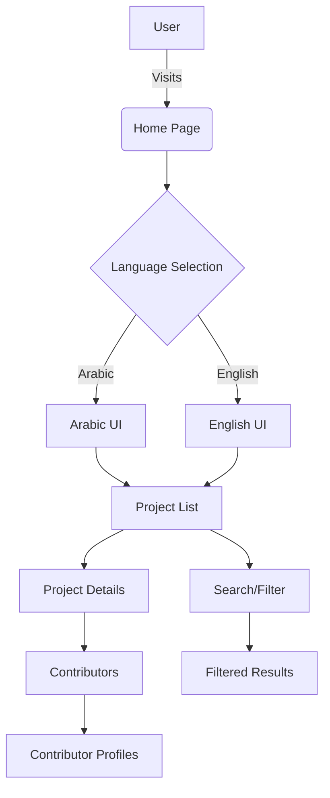
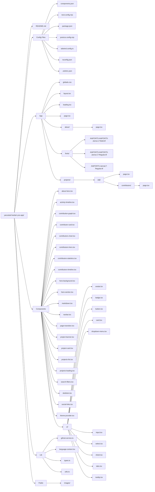
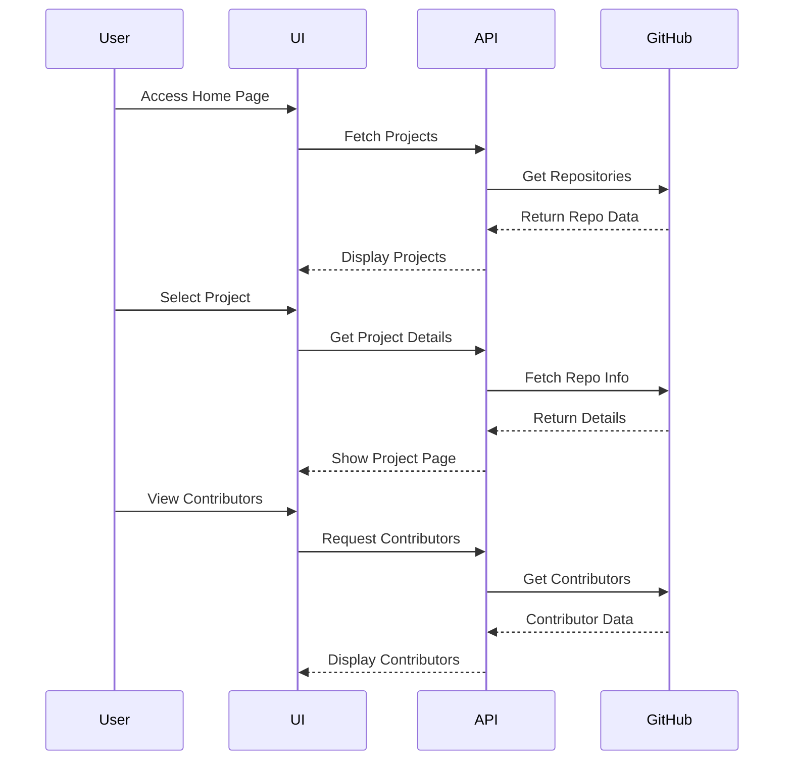
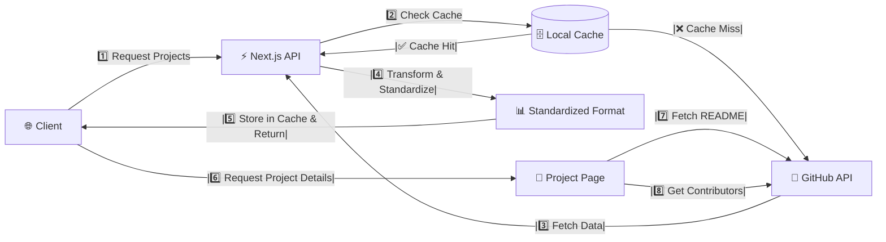

# Yemeni Open Source

A platform to discover and contribute to open source projects created by Yemeni developers.
## Live Demo
You can view a live demo of the platform here: [Yemeni Open Source](https://yemenopensource.vercel.app/)

## Links

- **[GitHub](https://github.com/YemenOpenSource)** 
- **[Twitter](https://x.com/yemenopensource)** 
- **[LinkedIn](https://www.linkedin.com/company/yemenopensource)** 
- **[Website](https://yemenopensource.vercel.app/)** 
- **[Email](mailto:opensource.ye@gmail.com)** 


## 📋 Project Overview



## ✨ Features

- 🌍 Multilingual support (Arabic/English)
- 📊 Interactive contribution graphs
- 🔍 Advanced search and filtering
- 👥 Contributor statistics and timelines
- 🔄 Real-time GitHub API synchronization
- 🎨 Responsive design with theme support

## 🚀 Getting Started

### Prerequisites
- Node.js 18+
- npm 9+

### Installation
```bash
git clone https://github.com/YacoubAl-hardari/yos-app.git
cd yos-app
npm install --legacy-peer-deps
npm run dev
```

## 📂 Directory Structure



## 🔄 User Flow



## 🤖 GitHub API Integration Flow



## 🛠 Technologies Used

- Next.js 15
- React 19
- TypeScript
- Tailwind CSS
- GitHub API
- Shadcn UI
- Recharts
- Framer Motion

## 🤝 Contributing

1. Fork the repository
2. Create a feature branch
3. Commit your changes
4. Push to the branch
5. Create a Pull Request


